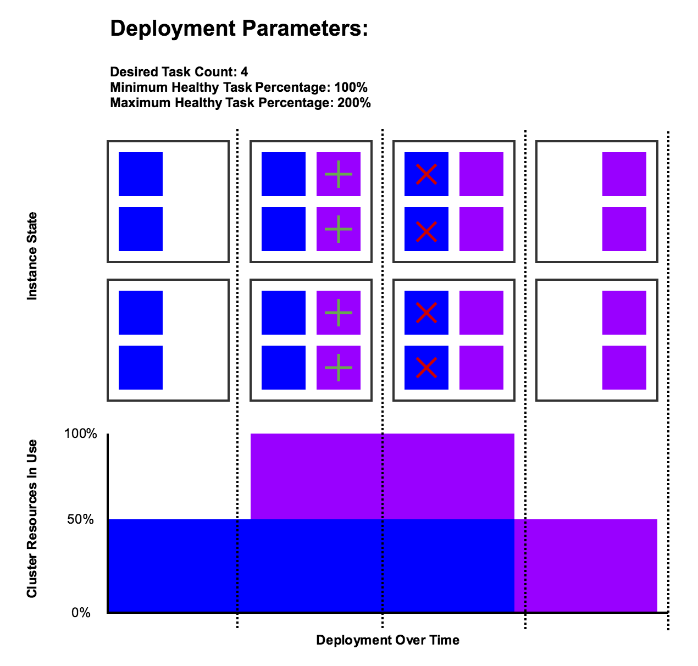
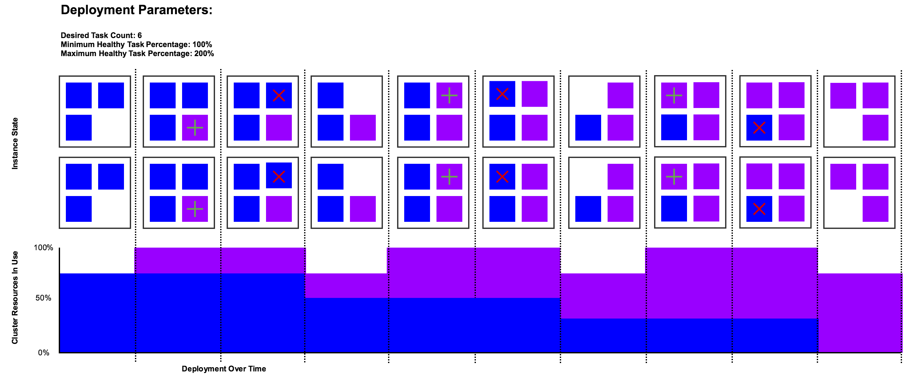
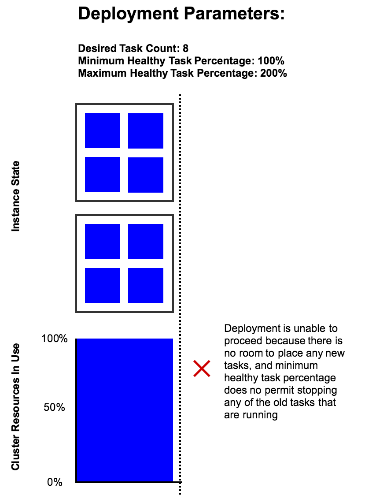
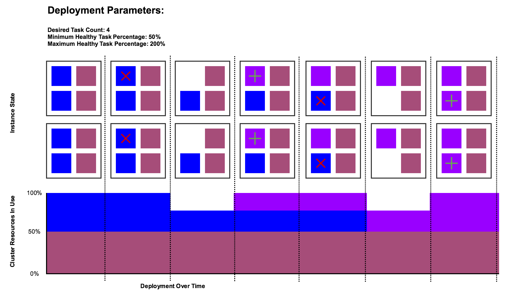

# AWS ECS Deployment Patterns

This is a visual guide to deployment options on Amazon EC2 Container Service. It is intended to explain how the "minimum healthy percent" and "maximum healthy percent" options function to allow you to finetune how your service updates are rolled out across your ECS cluster.

## A simple deploy

In the following example ECS sees that the minimum healthy percentage is 100% so it can not stop any tasks until new tasks have been launched in parallel. So it starts a set of the new tasks and then stops the old tasks:

AWS ECS always keeps a service within the defined healthy percentage in the deployment options. In this example there is not enough resources in the cluster to deploy the desired count of six new tasks in parallel with the desired count of six old tasks, so it takes several iterations of deploying a couple instances of the new task revision and then stopping a couple instances of the old task revision before ECS is able to fully roll out the new task revision:

## Deploying with high cluster resource utilization

If the cluster resource utilization is too high a deploy may be unable to proceed because it is not possible to carry out the deploy while still adhereing to the healthy task percentage limits. For example in the following deploy the two instances are fully utilized with no spare resources to launch another task, and the minimum healthy task percentage is set to 100%. In this state if you ask ECS to roll out a new task definition revision it will be unable to do so because it is not allowed to stop any of the running tasks, as that would take the service below 100% of its desired count.

However, if you set the minimum task percentage to a value less than 100% it will allow ECS to stop some of the old tasks in order to make room for a new task. In the following diagram you can see a cluster that is 100% utilized, in part by another existing task. The only way to deploy the new task revision is to stop some of the running tasks and then start new ones in their place.

